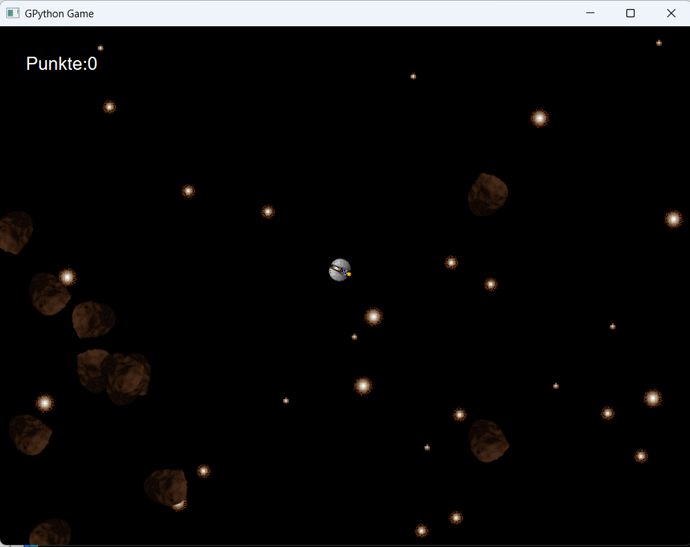
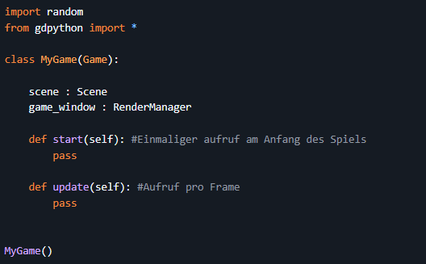
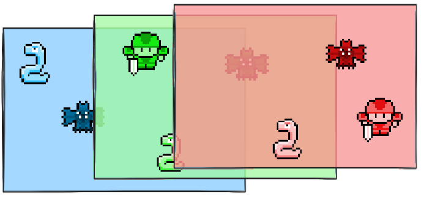
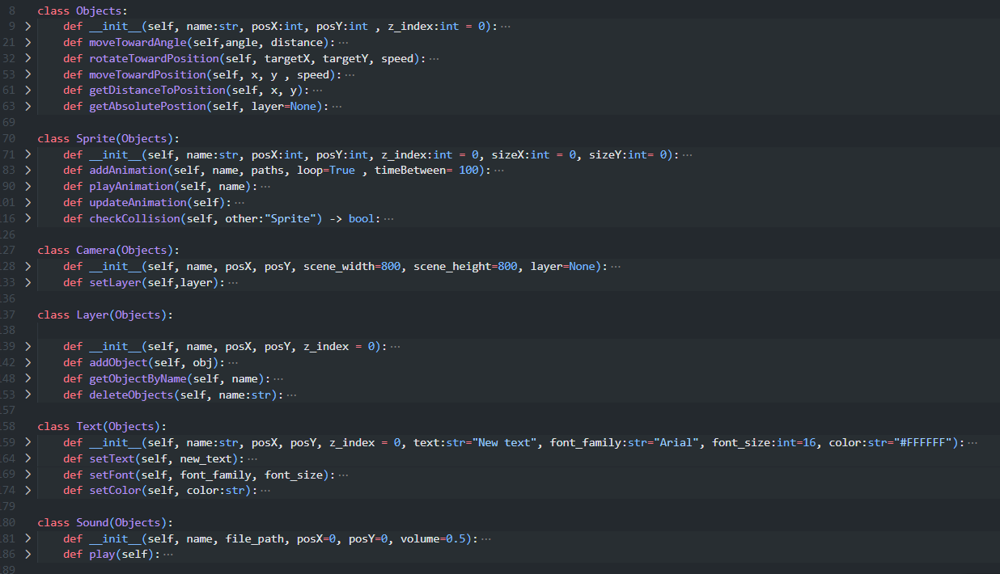

# GDPython - Eigene 2D Game-Engine in Python und Qt6

Mit GDPython habe ich eine eigene 2D Game-Engine entwickelt, die auf Python und dem Qt6-Framework basiert. Diese Engine bietet grundlegende Funktionen für die Entwicklung von 2D-Spielen, darunter Szenenverwaltung, Objekt- und Layer-Systeme, Rendering, Eingabeverarbeitung und eine einfache Game-Loop-Architektur.

#### Warum eine eigene Python Game-Engine?
 
Ich bin mir natürlich bewusst, dass es bereits viele etablierte Game-Engines gibt, wie z.B. Unity, Unreal Engine oder Godot und auch das Python für eine Game-Engine vermutlich die schlechsteste Wahl ist, wenn es um Performance geht. Dennoch wollte ich die Herausforderung annehmen und eine eigene Engine entwickeln, um meine Programmierfähigkeiten zu verbessern und ein tieferes Verständnis für die Funktionsweise von Game-Engines zu erlangen. Zudem wollte ich für meine Rolle als Trainer ein projekt bauen, das meine Teilnehmer inspirieren könnte, selbst kreativ zu werden und eigene Projekte zu starten.

#### Erste Schritte
Ich habe also für dieses Projekt überlegt wie ich dieses am besten Umsetzen kann und hatte damit das ganze realistisch bleibt mir zwei Vorgaben gesetzt:

1. Ich werde keinen eigenen Fenster Manager schreiben, sondern das Qt6 Framework verwenden, um Fenster zu erstellen und Eingaben zu verarbeiten. Einen eigenen Fenster Manager zu schreiben wäre einfach zu aufwendig und hätte den Rahmen dieses Projekts gesprengt.

 

2. Da ich bereits mit der einen oder anderen Game-Engine vertraut bin, war mir das Design der Engine relativ klar; Es sollte eine Start Funktion geben, die die Engine initialisiert und in der alle wichtigen Parameter gesetzt werden, der spätere "Game-Designer" kann dort seine Objekte, Sprites, Szenen usw. initialisieren. Danach sollte eine Game-Loop Funktion starten, in der der jeweilige Entwickler seine Logik schreibt und die in regelmäßigen Abständen die Spielobjekte aktualisiert und die Szene neu rendert.

#### Im Kern steht das GameObject

Das Herzstück der Engine ist das `GameObject`-Klasse. Jedes Objekt im Spiel, sei es eine Figur mit einer Liste an Bildern (Sprites), ein Kamera, eine Audioquelle oder gar ein Layer auf dem sich andere Objekte befinden, erbt von dieser Klasse. Dadurch erhalten alle Objekte grundlegende Eigenschaften und Methoden, die für die Verwaltung und Darstellung im Spiel notwendig sind. Man kann also getrost das fast alles in der Game Engine ein objekt ist.

#### Lauter kleine Hilfsfunktionen

Grundlegen habe ich natürlich funktionalitäten implementiert die das Rendern von Bildern, Das Abpielen von Animationen, Das Wechseln Der Kamera, Die Darstellung im Raum und die Eingabeverarbeitung ermöglichen. Zusätzlich habe ich einige Hilfsfunktionen implementiert, die das Arbeiten mit der Engine erleichtern damit man als nutzer nicht alles von Grund auf neu schreiben muss. Dazu gehören Funktionen von Vektoroperationen (Objekt dreht sich richtunf Position/Mauszeiger/AnderesObjekt), Multilayering für Parallaxeffekte und UI, Kollisionserkennung, Zeitmanagement und vieles mehr.

#### Veröffentlichung als Open-Source-Paket
Mir war es wichtig, das sowhl meine Teilnehmer als auch andere Entwickler von meiner Arbeit profitieren können. Ja diese Engine ist bei weitem nicht so mächtig wie andere etablierte Game-Engines und steckt zugegeben noch in den Kinderschuhen, aber ich habe mich entschieden, GDPython als Open-Source-Paket auf PyPI und GitHub zu veröffentlichen, damit andere Entwickler die Engine nutzen, anpassen und weiterentwickeln können. Der Quellcode ist frei zugänglich und ich freue mich über Feedback, Beiträge und Anregungen. 

