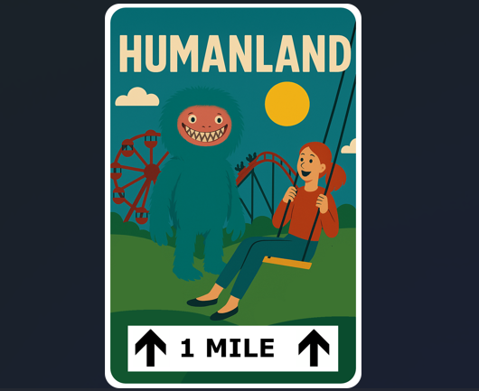
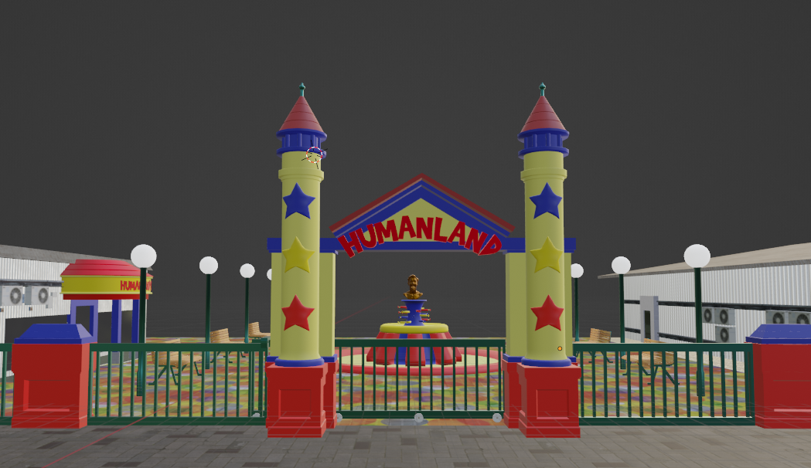
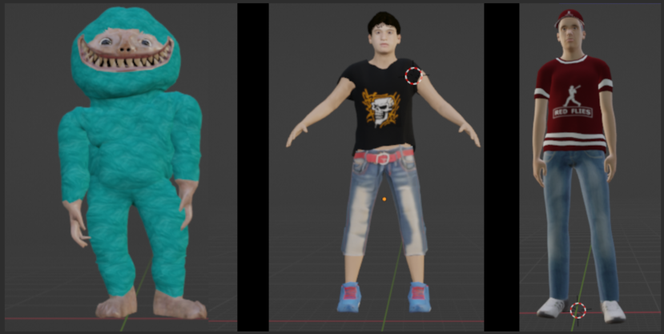

# Humanland – Ein an Poppyplaytime angelehntes Spiel

#### Inspiration und Zielsetzung
Wenn ich sehe, welche Erfolge Spiele wie Five Nights at Freddy's oder Poppyplaytime haben, und das eine oder andere Let's Play dazu auf YouTube sehe, dann jucken auch mir die Finger, selbst so ein Spiel zu entwickeln und vielleicht ähnlichen Erfolg zu haben – das gebe ich ganz schamlos zu. Also habe ich mich daran gemacht, ein eigenes Spiel in diese Richtung zu entwickeln, mit dem Ziel, meine Programmierfähigkeiten zu verbessern und ein unterhaltsames Spielerlebnis zu schaffen.

Hierbei sollte ich vielleicht erwähnen, dass Indie-Game-Entwicklung für mich jetzt kein Neuland ist und ich bereits damals das eine oder andere Spiel im Google Play Store veröffentlicht habe. Allerdings waren das immer eher kleine Spiele, meistens Node-Programmierung auf Basis der GameDevelop-Engine. Mit Humanland wollte ich jetzt mal ein etwas größeres Projekt umsetzen – in einem 3D-Setting, diesmal aber mit der Game-Engine Godot, weil diese Open Source ist und ich inzwischen nicht mehr so viel Vertrauen in Unity habe (nach den ganzen Lizenzänderungen, auch wenn diese wieder zurückgerudert wurden).

#### Storytelling und Gameplay

Für ein Spiel, das einem Poppyplaytime würdig ist, musste es natürlich auch eine spannende Story geben. In Humanland sollte der Spieler in die Rolle eines zehnjährigen Kindes schlüpfen, das sich zusammen mit seinem Bruder und seinem Vater, der sich im Wald verfährt, auf dem Weg zu PizzaUniverse auf dem Parkplatz eines mysteriösen, verlassenen Freizeitparks namens Humanland wiederfindet, der zwar keine Menschenseele beherbergt, dafür aber eine Vielzahl von Parkmaskottchen. Schnell stellt sich jedoch heraus, dass die freundlichen Maskottchen stark bemüht sind, die Parkbesucher möglichst lange im Park zu behalten und bis zum Sonnenuntergang zu verhindern, dass diese den Park verlassen. Nach Sonnenuntergang stellt man schnell fest, dass die Maskottchen sich in bösartige Kreaturen verwandeln, die Jagd auf die Besucher machen. Der Spieler muss also versuchen, mit Hilfe seines Bruders und seines Vaters den Park zu erkunden, Rätsel zu lösen und zu überleben.

#### Was brauchte ich alles?

Um dieses Spiel zu entwickeln, brauchte ich natürlich eine Vielzahl von Ressourcen und Tools. Zunächst einmal benötigte ich die Godot Engine als Entwicklungsumgebung, da diese eine gute Balance zwischen Benutzerfreundlichkeit und Leistungsfähigkeit bietet. Für die 3D-Modellierung und Animationen verwendete ich Blender, ein Open-Source-Tool, das sich hervorragend für die Erstellung von 3D-Inhalten eignet. Texturen und Grafiken erstellte ich mit GIMP und Krita sowie mit KI-Tools wie Midjourney und ChatGPT. Für die Soundeffekte und Musik nutzte ich das KI-Tool Suno sowie Audacity zur Bearbeitung und verschiedene Online-Ressourcen für lizenzfreie Sounds.
Als Programmiersprache verwendete ich GDScript, die native Skriptsprache von Godot, die speziell für die Spieleentwicklung optimiert ist.

#### 3D-Modellierung und Animation

Natürlich hatte ich nicht die Ressourcen, um Motion Capturing zu betreiben, und jeden Dialog zu animieren wäre einfach zu aufwendig gewesen. Also habe ich eine Code-Lösung entwickelt, die es mir zumindest ermöglicht, Gesichtsanimationen für das Sprechen zu erstellen, indem ich verschiedene Mundbewegungen in Blender erstellt habe und die dann über das Auslesen der internen Audio-Peaks der Sounddatei in Godot gesteuert habe. So konnte ich relativ einfach Dialoge animieren, ohne jeden Frame von Hand animieren zu müssen.

#### Scripting und automatische Sequenzen
Ich hatte jetzt das Skript, hatte bereits Bäume, die Hauptcharaktere sowie ein Fahrzeugmodell erstellt und eine schöne Fahrzeugsequenz gebaut – am ehesten vergleichbar mit dem Schienenfahrzeug aus Half-Life 1, wo der Spieler minimal gesteuert werden kann, aber das Fahrzeug eine feste Route abfährt. Das kombinierte ich mit den Animationen und geskripteten Audiosequenzen (alle von mir eingesprochen 😅), um eine cinematische Einführung zu erstellen. Und das ist mir auch gelungen.

<video controls src="video.mp4"  width="640" height="360" title="Title"></video>

#### Warum das Projekt scheiterte

Um ehrlich zu sein... es war einfach viel zu groß für mich alleine und ich hatte mich total übernommen. Ich hatte mir viel zu viel vorgenommen und musste irgendwann einsehen, dass ich das nicht alleine stemmen kann. Nach 2 Monaten hatte ich gerade mal eine Intro-Sequenz und ein paar Modelle fertiggestellt. Also habe ich das Projekt schweren Herzens auf Eis gelegt. Vielleicht werde ich es irgendwann in der Zukunft wieder aufnehmen, aber im Moment konzentriere ich mich auf kleinere Projekte, die ich auch alleine bewältigen kann.

#### Fazit
Trotz des Scheiterns von Humanland habe ich viel gelernt und wertvolle Erfahrungen in der Spieleentwicklung gesammelt. Ich habe meine Fähigkeiten in der 3D-Modellierung, Animation und Programmierung verbessert und ein besseres Verständnis für die Herausforderungen und Anforderungen bei der Entwicklung eines Spiels gewonnen. Vielleicht werde ich in Zukunft wieder an diesem Projekt arbeiten oder ein neues Spiel starten, aber im Moment bin ich froh über die Erfahrungen, die ich gemacht habe.

