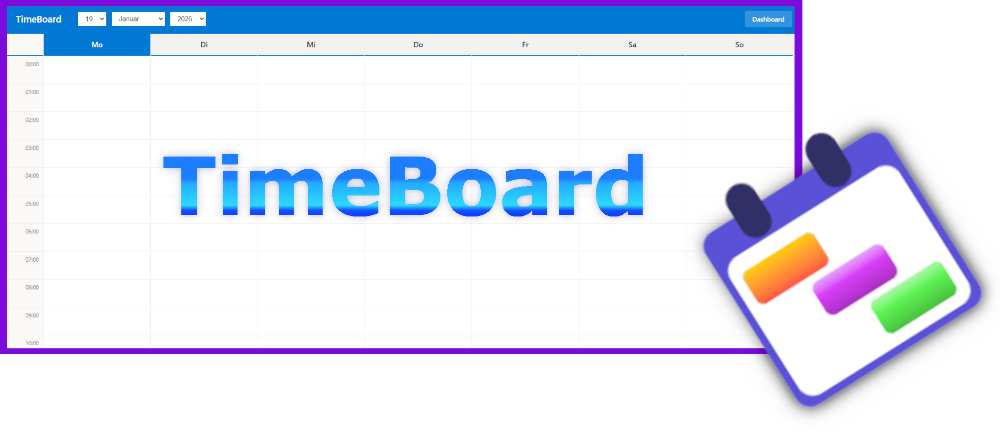
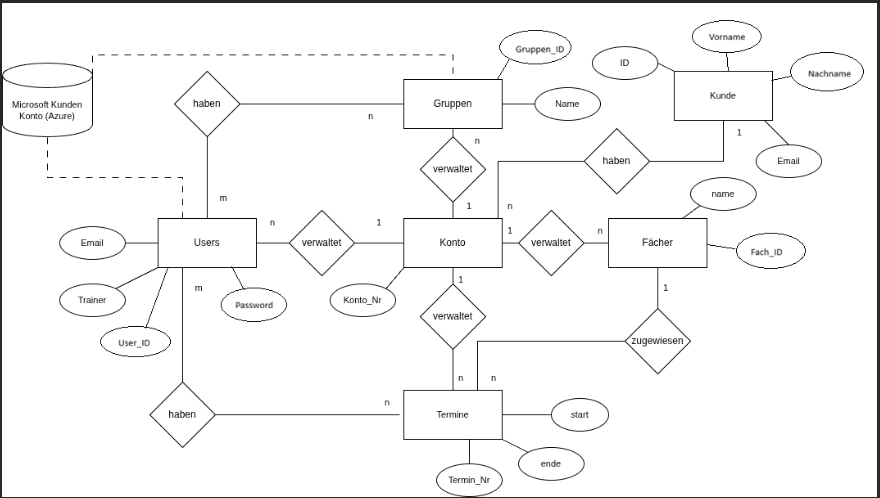
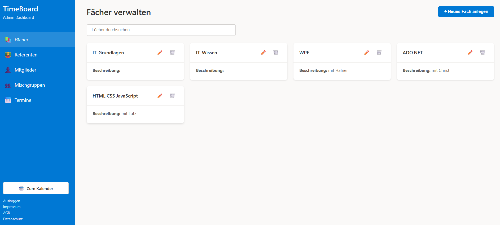
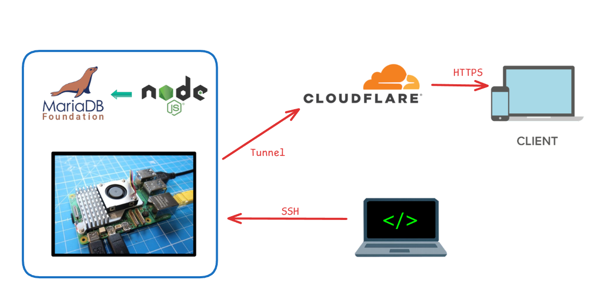
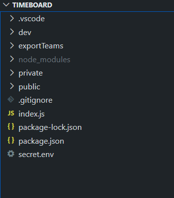

# TimeBoard
## Eine Software zum Planen von Schichten, Meetings, Aufgaben und Terminen

TimeBoard ist eine Software, die ich aktuell entwickle, um Unternehmen und Teams zu helfen, ihre Schichten, Meetings, Aufgaben und Termine besser zu planen und zu verwalten.
#### Motivation und Zielsetzung
Die Idee zu TimeBoard entstand, als ich nach Ideen suchte für Softwareprojekte, die für meine Firma, aber auch für andere nützlich sein könnten. Viele Unternehmen nutzen für Einsatzpläne, Schichtpläne und Terminplanung entweder veraltete Software oder sogar manuelle Methoden wie Excel-Tabellen oder Papierkalender. Diese Methoden sind oft ineffizient, fehleranfällig und schwer zu verwalten, besonders wenn es um größere Teams geht.
#### Das Ziel

Eine Software, die es ermöglicht, Mitarbeiter, Schüler und Teilnehmer zu speichern, in Gruppen zu organisieren, diese Gruppen mit Mischgruppen zu erweitern und diese mit Terminen sowie Dozenten, Trainern oder Gruppenleitern zu verbinden.
#### Geplante Grundfunktionen und Features:

- Node.js-Webserver mit teils clientseitiger, teils serverseitiger Architektur.
- Ein Datenbanksystem zur Speicherung von Benutzern, Gruppen, Terminen und anderen relevanten Daten.
- Ein Account-System, das es ermöglicht, Mitglieder einzuladen, ein Konto zu erstellen oder eine Organisation zu registrieren.
- Ein Mail-System zur Passwortzurücksetzung, Benachrichtigungen und Einladungen.
- Ein Kalendersystem, das es ermöglicht, Überblick über die eigenen Termine zu behalten.
- Ein Dashboard für Operatoren und Administratoren zur Verwaltung von Benutzern, Referenten, Gruppen, Mischgruppen und Terminen.
#### Aufbau einer Testumgebung
Mir ist es wichtig, TimeBoard in einer Umgebung zu testen, die wie eine echte Produktionsumgebung funktioniert; dafür habe ich mir ein System überlegt.

2. Ich habe einen einfachen Raspberry Pi 5 als Node.js-Server eingerichtet, der als Webserver für TimeBoard dient und MariaDB als lokale Datenbank nutzt.
3. Ich habe ein Tunnel-Protokoll (Cloudflare Tunnel) eingerichtet, um den Raspberry Pi sicher mit dem Internet zu verbinden. Danach war TimeBoard über die Domain https://timeboard.emshift.org erreichbar. Danach war der Raspberry Pi als mobiler Webserver einsetzbar, den ich beliebig vom Strom und Internet trennen kann, wenn ich gerade nicht daran arbeite.
4. Die eigentliche Entwicklung von TimeBoard findet lokal auf meinem Entwicklungsrechner statt. Ich nutze Visual Studio Code als IDE und GitHub für die Versionskontrolle.
#### Aufbau der Softwarearchitektur
Mir ist es bewusst, dass es eine Vielzahl an Frameworks und Bibliotheken gibt, die ich hätte nutzen können, um TimeBoard zu entwickeln. Ich habe aber bewusst auf React oder Angular verzichtet und eigene Komponenten entwickelt, um die Software schlank und performant zu halten.
##### Statisch und Dynamisch
In meiner Software sind die Seiten Login, Kalender und Dashboard als einzelne HTML-Seiten mit eingebettetem JavaScript und CSS aufgebaut. Die Seiten kommunizieren mit dem Server über REST-APIs, um Daten zu laden und zu speichern. Die Dashboard-Seite lädt dynamisch verschiedene Module basierend auf der Benutzerrolle (Operator, Administrator) und den verfügbaren Funktionen, genau wie die Kalender-Seite, die den Kalender dynamisch rendert, basierend auf den gespeicherten Terminen.
##### Struktur

Mir war und ist es wichtig, eine klare Struktur in meinem Dateibaum zu haben, daher habe ich die Dateien wie folgt organisiert:
- **/index.js**: Der Haupteinstiegspunkt der Anwendung, der den Express-Server initialisiert und die Middleware sowie die Routen konfiguriert.
- **/public**: Enthält statische Dateien wie HTML, CSS, JavaScript und Bilder.
  - **/modals**: Enthält die HTML-Modal-Komponenten für verschiedene Dialoge und Pop-ups.
  - **/styles**: Enthält die CSS-Dateien für das Styling der Anwendung.
  - **/js**: Enthält die JavaScript-Dateien für die Client-seitige Logik.
  - **/secure**: Enthält API-/me-Endpunkte, die Authentifizierung erfordern.
#### Sicherheit und Datenschutz
Mir ist es sehr wichtig, dass TimeBoard keine Angriffsfläche für Angreifer bietet und dass die Daten der Benutzer sicher gespeichert werden. Daher habe ich folgende Maßnahmen ergriffen:
- **Passwortsicherheit**: Ich nutze bcrypt, um Passwörter zu hashen, bevor sie in der Datenbank gespeichert werden. Dadurch sind die Passwörter auch bei einem Datenbankleck geschützt.
- **HTTPS**: Ich habe ein SSL-Zertifikat über Cloudflare eingerichtet, um sicherzustellen, dass alle Datenübertragungen zwischen dem Client und dem Server verschlüsselt sind.
- **Eingabevalidierung**: Ich validiere alle Benutzereingaben sowohl auf der Client- als auch auf der Server-Seite, um SQL-Injektionen und XSS-Angriffe zu verhindern.
- **Zugriffskontrolle**: Ich habe ein rollenbasiertes Zugriffskontrollsystem implementiert, um sicherzustellen, dass nur autorisierte Benutzer auf bestimmte Funktionen und Daten zugreifen können.
- **Sessionsmanagement**: Ich nutze sichere Cookies und implementiere Session-Timeouts, um unbefugten Zugriff zu verhindern.
- **Ratelimiting**: Ich habe Ratelimiting auf kritischen Endpunkten implementiert, um Brute-Force-Angriffe zu verhindern.
- **gehashte Tokens**: Ich nutze gehashte Tokens für die Authentifizierung und Autorisierung, um sicherzustellen, dass sensible Informationen nicht im Klartext übertragen oder gespeichert werden.
- **KI-gestützte Cross-Site-Scripting-Analyse**: Ich nutze in regelmäßigen Abständen KI-Tools, um den Code auf mögliche XSS-Schwachstellen zu analysieren und zu identifizieren.
#### Todos und Weiterentwicklung
TimeBoard ist aktuell noch nicht produktionsreif und befindet sich in der aktiven Entwicklung. Da ich die Software privat entwickle und keine externen Investoren habe, arbeite ich in meiner Freizeit daran und setze mir selbst Meilensteine und Ziele.
So entwickelt sich die Software Funktion für Funktion weiter bis zu einem MVP.
Hier sind einige der nächsten Schritte und Funktionen, die ich plane zu implementieren:
- **UI-Anpassung für mobile Geräte**: Es gibt immer noch einige Bugs und gerade ein umfangreicher Kalender ist auf kleinen Bildschirmen schwer zu bedienen.
- **Grundfunktionalität für das Löschen von Accounts und Organisationen**: Aktuell gibt es keine Möglichkeit für Benutzer oder Administratoren, ihre Accounts oder Organisationen zu löschen. Dies ist eine wichtige Funktion, um den Datenschutzanforderungen gerecht zu werden.
- **Backup und Wiederherstellung**: Implementierung eines Systems zur regelmäßigen Sicherung der Datenbank und zur Wiederherstellung im Falle eines Datenverlusts.
- **Admin-Board für den Betreiber**: Ein spezielles Dashboard für den Betreiber der TimeBoard-Instanz (also aktuell mich) zur Überwachung und Verwaltung der gesamten Anwendung. Dies soll ermöglichen, Überblick über die Datenbank zu bekommen und Statistiken einzusehen, sowie eingeschränkte SQL-Transaktionen und Abfragen durchzuführen, ohne jedes Mal über SSH eine Verbindung zum Server herstellen zu müssen. Nebenbei wäre das auch für die Wartung von Vorteil.
#### Projektstatus
TimeBoard befindet sich aktuell in der aktiven Entwicklung. Die meisten Grundfunktionen sind bereits implementiert und funktionsfähig. Das Projekt ist aktuell ein privates Repository auf GitHub, aber ich gebe den Code gerne auf Anfrage frei.

