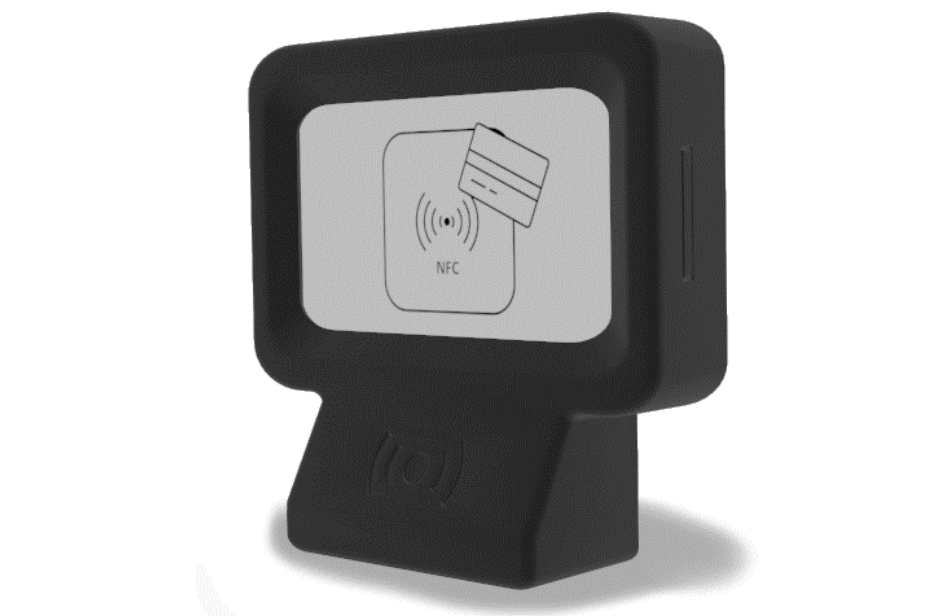
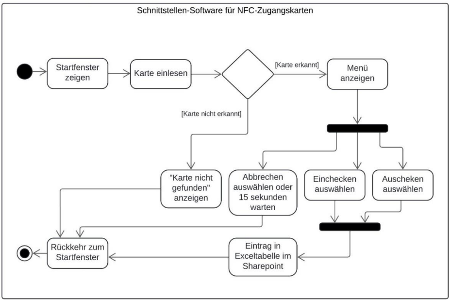
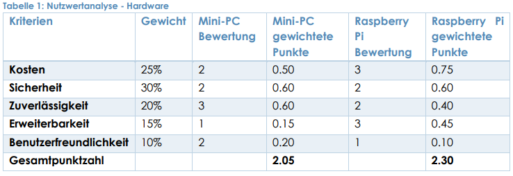
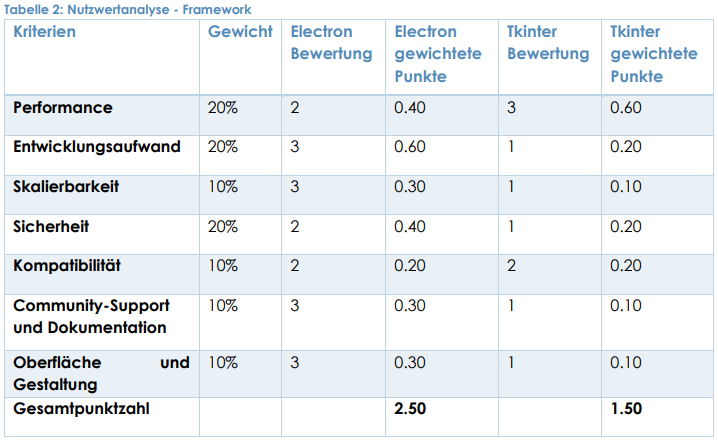
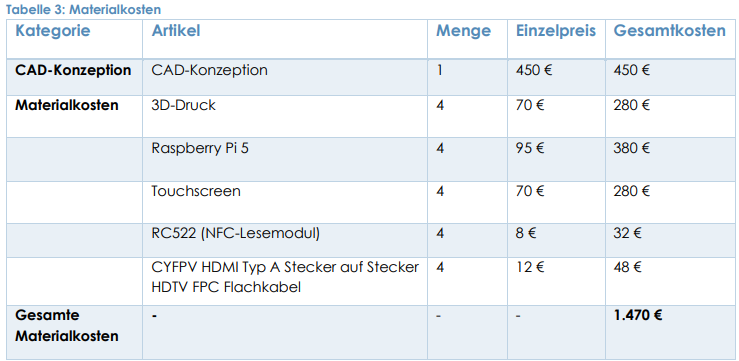
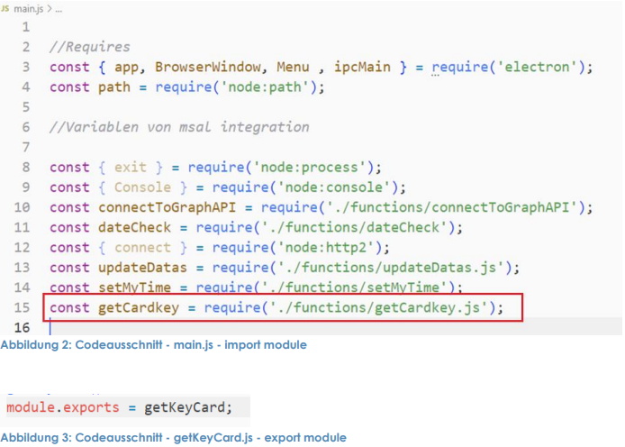
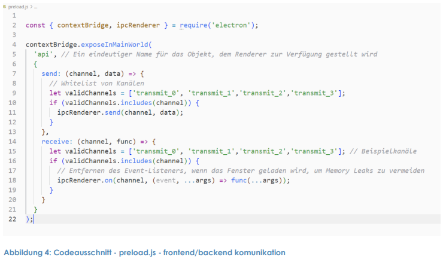
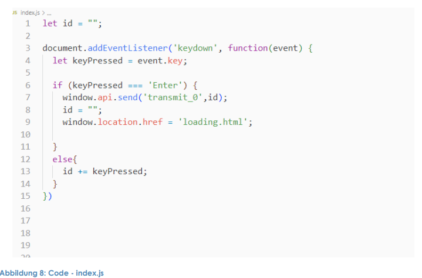
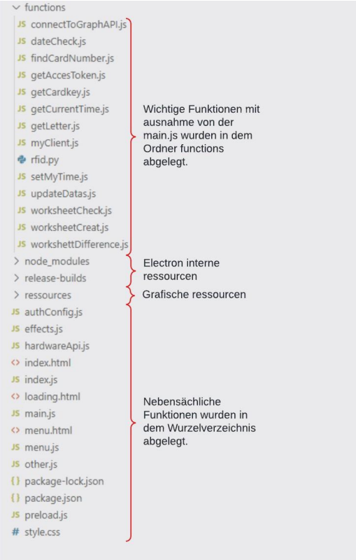
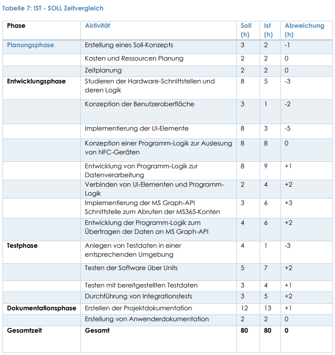

# IHK Abschlussprojekt - TimeStamp

## Eine Software zur Anwesenheits- und Zeiterfassung von Teilnehmenden.

### 1. EINLEITUNG

Die vorliegende Projektdokumentation beschreibt ein Abschlussprojekt im Rahmen meiner Umschulung zum Fachinformatiker für Anwendungsentwicklung bei der Lutz & Grub Academy. Ziel des Projekts war die Konzeption und Umsetzung einer Softwarelösung zur automatisierten Anwesenheitsregistrierung und Zugangskontrolle mittels NFC-Technologie.

Das Projekt adressiert organisatorische und administrative Prozesse in einer Bildungseinrichtung und demonstriert die Entwicklung einer praxisnahen Schnittstellen-Software mit Fokus auf Automatisierung, Sicherheit und Effizienz.

##### 1.1 PROJEKTUMFELD

Das Projekt wurde im Umfeld einer Bildungseinrichtung entwickelt und erprobt. Es war Teil einer Initiative zur Optimierung administrativer Abläufe, insbesondere im Bereich der Anwesenheitsverwaltung und Zugangskontrolle.
Die Anwendung richtet sich sowohl an Teilnehmende als auch an administrative Mitarbeitende und wurde in enger Abstimmung mit den fachlichen Anforderungen des Projektumfelds umgesetzt.

(Hinweis: Rollen und organisatorische Details wurden aus Gründen des Datenschutzes abstrahiert.)

##### 1.2 PROJEKTZIEL

Ziel des Projekts war die Entwicklung einer Anwendung, die es ermöglicht, die Anwesenheit von Teilnehmenden automatisiert über NFC-Zugangskarten zu erfassen und gleichzeitig den Zutritt zu bestimmten Bereichen zu kontrollieren.

Der Schwerpunkt meiner Projektarbeit lag auf:

- der Umsetzung der NFC-basierten Erfassung
- der Verarbeitung und Speicherung der Zeitstempel
- der Entwicklung der zugehörigen Software-Schnittstellen

Optional vorgesehene Erweiterungen (z. B. zusätzliche Ausgabefunktionen) waren nicht Bestandteil meines primären Aufgabenbereichs.

##### 1.3 PROJEKTBEGRÜNDUNG

Die Motivation für das Projekt ergab sich aus der zuvor eingesetzten manuellen Anwesenheitskontrolle, die zeitintensiv und fehleranfällig war. Durch die Automatisierung dieses Prozesses sollte die Effizienz gesteigert, die Datenqualität verbessert und der administrative Aufwand für Mitarbeitende reduziert werden.

Der Einsatz von NFC-Technologie ermöglicht eine schnelle, kontaktlose und zuverlässige Datenerfassung und stellt eine skalierbare Lösung für den täglichen Betrieb dar.

##### 1.4 PROJEKTSCHNITTSTELLEN

Die entwickelte Anwendung fungiert als zentrale Schnittstelle zur Erfassung und Verarbeitung von Anwesenheitsdaten über NFC-Zugangskarten. Die erfassten Zeitstempel werden strukturiert gespeichert und stehen für weitere Auswertungen und Folgeprozesse zur Verfügung.

Eine mögliche Erweiterung des Gesamtsystems stellt ein separates Folgeprojekt dar, das die Entwicklung einer zusätzlichen Verwaltungssoftware umfasst. Diese Software könnte direkt auf die erfassten Anwesenheitsdaten zugreifen und Funktionen wie das Sortieren, Filtern sowie die grafische Auswertung von Teilnehmerinformationen bereitstellen. Ziel einer solchen Erweiterung wäre die weitere Reduktion des administrativen Aufwands sowie eine verbesserte Übersicht und Bewertung der Anwesenheitsdaten.

Diese Erweiterung war nicht Bestandteil des vorliegenden Projekts, wurde jedoch im Rahmen der Planung als potenzielle Schnittstelle berücksichtigt.

##### 1.5 PROJEKTABGRENZUNG

Das Projekt konzentrierte sich ausschließlich auf die Entwicklung der Software zur Erfassung und Verarbeitung von Anwesenheitsdaten über NFC-Zugangskarten. Dies umfasste sowohl die Gestaltung des Frontends als auch die Implementierung der Backend-Logik und der relevanten Schnittstellen.

Folgende unterstützende Aufgaben lagen außerhalb des Projektumfangs und wurden nicht durch mich umgesetzt:
- Bereitstellung und Verwaltung der Netzwerksicherheit sowie VPN-Infrastruktur
- Implementierung und Integration zusätzlicher Ausgabesysteme
- Installation und Inbetriebnahme der Hardwarekomponenten
- Umsetzung physischer Sicherheitsmaßnahmen an den Endgeräten

Durch diese klare Abgrenzung konnte der Fokus gezielt auf die technische Konzeption und Umsetzung der Softwarelösung gelegt werden, während infrastrukturelle und organisatorische Aspekte separat behandelt wurden.

### 2. PROJEKTPLANUNG
##### 2.1 PROJEKTPHASEN
Im Rahmen des Projekts, mit insgesamt 80 Stunden Arbeitszeit, wurde eine strukturierte 
Vorgehensweise zur Entwicklung einer Applikation definiert. Dieses Projekt gliedert sich in 
verschiedene Phasen, um sicherzustellen, dass unsere Anforderungen effizient erfüllt werden. 
Die Phasen umfassen die Planungsphase, die Entwicklungsphase, die Testphase, die 
Dokumentationsphase sowie das Anfertigen der Dokumentation. Diese Phasen sind in 
folgender Tabelle mit Zeitangabe eingetragen, um im späteren Verlauf eine bessere 
Zeiteinteilung der Arbeitspakete zu gewährleisten:
Eine detaillierte Darstellung der zeitlichen Aufteilung des Projekts ist im Gantt-Diagramm
ersichtlich, das in den beigefügten Anlagen zur Verfügung gestellt wird, siehe Abbildung 5: 
Gantt-Diagramm und in der folgenden Tabelle.

##### 2.2 RESSOURCENPLANUNG
**Entscheidungsfindung für das Framework und die Hardware**
Bei der Auswahl des Frameworks fiel die Entscheidung auf Electron, das besonders durch seine 
Fähigkeit überzeugt, robuste Weboberflächen zu kreieren und eine sichere 
Serverkommunikation zu ermöglichen. Trotz seines hohen Ressourcenverbrauchs bietet 
Electron eine herausragende Plattform für die plattformübergreifende Entwicklung, 
insbesondere unter Linux-Systemen, was eine konsistente und einheitliche Benutzererfahrung 
garantiert. Darüber hinaus legte man großen Wert auf die Nutzung von Softwarekomponenten, 
die unter Open-Source-Lizenzen lizenziert sind, um Lizenzkonflikte zu vermeiden und eine 
vollständige Kompatibilität mit den unternehmensspezifischen Anforderungen zu 
gewährleisten.

**Bewertung der Hardware-Optionen**
Ursprünglich wurde der Einsatz eines Mini-PCs in Betracht gezogen, der mit einem USB-NFC-Lesegerät und einem Touchmonitor ausgestattet sein sollte. Diese Idee wurde jedoch aus 
mehreren Gründen verworfen:
- **Montage und Ästhetik:** Die Montage der Vorrichtung im Eingangsbereich und die 
Unterbringung der Komponenten in einem ansprechenden Gehäuse würden sich als 
praktisch schwierig erweisen.
- **Sicherheitsrisiken:** Die Nutzung von USB-Peripheriegeräten erhöhte das Risiko des 
unbefugten Zugriffs über den USB-Port des Mini-PCs, was die Sicherheit des Gesamtsystems 
beeinträchtigen könnte.
- **Diebstahlrisiko:** Es bestand auch die Gefahr, dass die USB-NFC-Lesehardware leicht 
entwendet werden könnte, was ein zusätzliches Sicherheitsrisiko darstellt.

Aufgrund dieser Bedenken entschied man sich für den Raspberry Pi 5, der genügend Leistung 
bietet, um die Electron-Anwendung auszuführen und durch die Verwendung eines internen 
RFID-Moduls über die GPIO-Schnittstelle eine sicherere und stabilere Lösung bietet.

**Gehäusekonzeption und Sicherheitsmaßnahmen**
Das Gehäuse für den Raspberry Pi und das RFID-Modul wird speziell angefertigt, um sowohl die 
Ästhetik als auch die Sicherheit zu gewährleisten. Ein CAD-Modell wird entwickelt und 
anschließend von einer 3D-Druckerei umgesetzt. Dies ermöglicht eine sichere und 
maßgeschneiderte Lösung, die den physischen Schutz der Hardware gewährleistet.

##### 2.3 ENTWICKLUNGSPROZESS 
Im Rahmen des IHK-Projekts zur Entwicklung einer Schnittstellen-Software für NFC-Zugangskarten wurde ein agiler Entwicklungsansatz gewählt. Dieser Ansatz war besonders 
geeignet, um flexibel auf Veränderungen im Projektverlauf reagieren zu können und stellte 
sicher, dass die Projektziele trotz der dynamischen Anforderungen effektiv erreicht wurden.

**Agile Methodik und tägliche Standup-Meetings**
Trotz des Umstands, dass es sich um ein Einzelprojekt handelte, wurden Elemente der agilen 
Methodik adaptiert. Dazu gehörten tägliche Standup-Meetings in Form von kurzen, 
strukturierten Selbstbesprechungen. Diese dienten dazu, den Fortschritt kontinuierlich zu 
überwachen und die Selbstorganisation zu fördern. In diesen Meetings wurden täglich drei 
Kernfragen behandelt:
- **Was wurde gestern getan?** - Die Beantwortung dieser Frage half dabei, die am Vortag 
erledigten Aufgaben zu reflektieren und den Beitrag zum Projektfortschritt zu 
dokumentieren.

- **Was wird heute getan?** - Durch das Festlegen der Tagesziele konnte eine klare Strukturierung 
der täglichen Aktivitäten erreicht und deren Ausrichtung auf die Projektziele sichergestellt 
werden.

- **Gibt es Hindernisse?**, die eine Behinderung darstellen? - Diese Frage ermöglichte es, 
frühzeitig potenzielle Probleme zu identifizieren und Lösungsstrategien zu entwickeln, um 
den Projektverlauf effizient zu gestalten und Verzögerungen zu vermeiden.

**Vorteile des agilen Modells für das Projekt**
Die Implementierung der agilen Prinzipien in das Einzelprojekt trug wesentlich zur Verbesserung 
der Transparenz und Effizienz des Arbeitsprozesses bei. Die regelmäßige Selbstreflexion und 
Planung förderten eine zielgerichtete und adaptive Arbeitsweise, die es ermöglichte, auf 
Herausforderungen schnell zu reagieren. Die täglichen Standup-Meetings unterstützten dabei, 
den Überblick zu behalten und den Entwicklungsprozess kontinuierlich zu optimieren.
Durch diese agile und strukturierte Vorgehensweise konnte der Projektverlauf effektiv gesteuert 
werden, und die Entwicklung der Softwareanwendung schritt trotz der Herausforderungen 
planmäßig voran, wobei alle technischen und funktionalen Anforderungen erfolgreich 
umgesetzt wurden.

In der Dokumentation des Projekts zur automatisierten Anwesenheitsregistrierung wurde ein Use 
Case-Diagramm erstellt, siehe Abbildung 6: Use Case Diagramm in den Anlagen. Dieses 
Diagramm visualisiert die verschiedenen Interaktionen der Nutzer mit dem NFC-basierten 
System und bietet eine klare Darstellung der verfügbaren Funktionen sowie der Rollen der 
verschiedenen Benutzergruppen.

In der Entwicklungsphase des NFC-basierten Anwesenheitssystems wurde ein 
Aktivitätsdiagramm erstellt, um die dynamischen Aspekte des Systems und die sequenzielle 
Abfolge der Interaktionen der Benutzer mit der Anwendung zu visualisieren. Dieses Diagramm 
hilft dabei, den Ablauf von Prozessen und die Entscheidungspunkte innerhalb der Anwendung 
zu verstehen.

### 3. ANALYSEPHASE
##### 3.1 IST-ANALYSE
**Aktueller Stand der Anwesenheits- und Zugangskontrolle:** 

 ###### -> Dieser Teil wurde aus Datenschutzgründen entfernt <-

##### 3.2 RISIKOANALYSE
Eine umfassende Risikoanalyse wurde durchgeführt, um die verschiedenen potenziellen Risiken 
zu identifizieren und zu bewerten, die das Projekt beeinflussen könnten. Die Analyse deckt 
mehrere kritische Bereiche ab, einschließlich technischer, organisatorischer, 
sicherheitsbezogener sowie rechtlicher und Compliance-bezogener Aspekte. Ziel ist es, die 
Wahrscheinlichkeit und den Schweregrad möglicher Probleme zu verstehen und 
entsprechende Vorkehrungen und Maßnahmen zu planen, um die Risiken effektiv zu 
minimieren. Details und spezifische Ergebnisse dieser Risikoanalyse finden sich im Anhang dieses 
Dokuments in der Tabelle Risikoanalyse. 

##### 3.3 NUTZWERTANALYSE
**Nutzwertanalyse für die Auswahl der Hardware**

**Ziel:** Das Hauptziel dieses Projekts ist es, die optimale Hardware-Konfiguration für ein NFC-basiertes Anwesenheitssystem sorgfältig auszuwählen und zu implementieren. Dies beinhaltet eine gründliche Bewertung verschiedener Hardwareoptionen, um eine Lösung zu finden, die technische Leistungsfähigkeit mit den speziellen Bedürfnissen und Anforderungen der Bildungseinrichtung vereint. Die ideale Hardware muss eine zuverlässige und sichere NFC-Kommunikation ermöglichen, geringen Wartungsbedarf aufweisen und leicht von allen Nutzern bedienbar sein. Außerdem sollte sie erweiterbar sein, um zukünftige technologische Entwicklungen unterstützen zu können. Eine umfassende Analyse soll sicherstellen, dass die ausgewählte Lösung nicht nur funktional und kosteneffektiv ist, sondern auch langfristig den Betrieb und die Sicherheitsanforderungen der Einrichtung unterstützt.

**Alternativen:**
- Mini-PC mit USB-NFC-Lesegerät
- Raspberry Pi 5 mit integriertem RFID-Modul

**Bewertung:**

**Ergebnis:** Basierend auf der Nutzwertanalyse erreicht der Raspberry Pi 5 mit einem Gesamtwert 
von 2.30 Punkten einen leicht höheren Gesamtwert als der Mini-PC mit 2.05 Punkten. Obwohl 
der Mini-PC in Bezug auf Zuverlässigkeit besser bewertet wurde, überzeugt der Raspberry Pi 
durch seine höhere Punktzahl bei den Kosten und der Erweiterbarkeit sowie gleiche Bewertungen bei 
der Sicherheit. Dies macht den Raspberry Pi 5 zur bevorzugten Wahl für das NFC-Zugangssystem, insbesondere wegen seiner besseren Erweiterbarkeit und Kosteneffizienz.

**Nutzwertanalyse für die Auswahl der Software:** Für das Projekt der NFC-basierten Anwesenheits- und Zugangskontrollsysteme wurden zwei Frameworks in Betracht gezogen, die dem Entwickler 
bereits bekannt waren, um das Projekt zeitgerecht umsetzen zu können: Electron und Tkinter.

**Ziel:** Ein Ziel dieses Projekts ist die Auswahl der optimalen Softwareplattform für die 
Implementierung der NFC-basierten Schnittstellensoftware. Diese Entscheidung wird auf Basis 
einer sorgfältigen Analyse verschiedener verfügbarer Softwarelösungen getroffen, um 
sicherzustellen, dass die gewählte Plattform die spezifischen Anforderungen des NFC-Systems 
erfüllt. Die ideale Software muss eine effiziente, sichere und zuverlässige Integration der NFC Technologie ermöglichen, dabei skalierbar sein und eine einfache Anpassung an zukünftige 
Anforderungen unterstützen. Außerdem sollte sie eine intuitive Benutzeroberfläche bieten, die 
die Bedienbarkeit für Endnutzer erleichtert. Die Auswahl der Softwareplattform erfolgt unter 
Berücksichtigung ihrer Leistungsfähigkeit, Kompatibilität mit vorhandener Hardware, 
Unterstützung durch den Entwicklergemeinschaft und langfristigen Wartungsperspektiven, um 
eine robuste und nachhaltige Lösung zu gewährleisten.

**Alternativen:**
• Electron Framework
• Tkinter

**Bewertung:**

**Ergebnis:** Mit den angepassten Bewertungen erhält das Electron Framework weiterhin einen 
höheren Gesamtwert von 2.50 Punkten, während Tkinter auf 1.50 Punkte kommt. Electron bietet 
weiterhin Vorteile in den Bereichen Entwicklungsaufwand, Skalierbarkeit, Community-Support 
und Gestaltung der Oberfläche. Obwohl Tkinter in der Performance führt, zeigt die Analyse, 
dass Electron insgesamt besser auf die Bedürfnisse und Anforderungen des Projekts abgestimmt 
ist. Electron ermöglicht eine effizientere Entwicklung und bietet umfangreichere Unterstützung 
sowie bessere Gestaltungsmöglichkeiten, was für die erfolgreiche Umsetzung des Projekts 
entscheidend ist.

##### 3.4 ANWENDUNGSFÄLLE
Das NFC-basierte Anwesenheitserfassungssystem der LUTZ & GRUB Academy steigert die 
operative Effizienz und Sicherheit. Der Hauptanwendungsfall ist die automatische 
Anwesenheitsregistrierung, die manuelle Check-ins ersetzt und die Genauigkeit der 
Teilnehmerdaten verbessert. Diese Funktion reduziert administrative Belastungen und 
verbessert die Benutzerfreundlichkeit der Einrichtung, indem sie eine einfache und effiziente 
Überwachung der Teilnehmeranwesenheit ermöglicht.

##### 3.5 PROJEKTKOSTEN
Die Projektkosten setzen sich aus zwei Hauptkategorien zusammen: Materialkosten und 
Personalkosten. Die Materialkosten umfassen die Konzeption, den Druck und die notwendige 
Hardware für das Projekt.

Die Materialkosten für das Projekt zur Implementierung eines NFC-basierten Zugangs- und 
Anwesenheitssystems an der LUTZ & GRUB Academy setzen sich aus verschiedenen Hardware- und Entwicklungsressourcen zusammen. Diese Kosten sind ein wesentlicher Bestandteil des 
Gesamtbudgets und beeinflussen die Wirtschaftlichkeit und Durchführbarkeit des Projekts.

Die Personalkosten für das Projekt zur Implementierung eines NFC-basierten 
Anwesenheitssystems an der LUTZ & GRUB Academy setzen sich aus den Aufwendungen für 
das Entwicklerteam zusammen, das an der Planung, Entwicklung und Implementierung der 
Software sowie der Integration der Hardware beteiligt ist. Diese Kosten sind entscheidend für 
die erfolgreiche Umsetzung des Projekts und gewährleisten, dass qualifizierte Fachkräfte die 
erforderlichen Arbeiten durchführen.

Die Gesamtkosten des Projekts zur Implementierung des NFC-basierten Zugangs- und 
Anwesenheitssystems ergeben sich aus der Summe der Personalkosten und der Materialkosten. 
Durch die Addition dieser beiden Kostenarten erhalten wir die Gesamtkosten, die eine 
umfassende Darstellung der finanziellen Investition in das Projekt bieten und zur Budgetplanung 
und -kontrolle beitragen.

###### -> Personalkosten wurden aus Datenschutzgründen entfernt <-

##### 3.6 LASTENHEFT:
Das Lastenheft für das Projekt der automatisierten Anwesenheitsregistrierung und 
Zugangskontrolle mittels NFC-Technologie wurde intern erstellt und umfasst die grundlegenden 
Ideen und zentralen Anforderungen, die zur Entlastung der Verwaltung der LUTZ & GRUB 
Academy beitragen sollen. Es definiert die wesentlichen Funktionen und Ziele des Systems, 
welche die Effizienz und Genauigkeit der administrativen Prozesse verbessern sollen. 
Ursprünglich enthielt das Lastenheft auch die Implementierung eines Systems zur Ausgabe von 
WiFi-Vouchern. Dieser Aspekt wurde jedoch später aus dem Projektumfang entfernt, um 
Ressourcen für die Realisierung wichtigerer Projektziele zu priorisieren. Das Lastenheft dient als 
formale Grundlage für die weitere Projektentwicklung und legt fest, welche Anforderungen 
genau erfüllt werden müssen, um die angestrebten Verbesserungen in der Verwaltung effektiv 
umzusetzen.

### 4. ENTWURPSPHASE
##### 4.1 ZIELPLATTFORM
Die Zielplattform für die Entwicklung der NFC-basierten Anwesenheitsregistrierungs- und 
Zugangskontrollsoftware ist der Raspberry Pi 5. Diese Wahl fiel aufgrund seiner ausreichenden 
Leistungsfähigkeit, seiner Anpassungsfähigkeit an unterschiedliche Hardwarekomponenten 
und seiner Fähigkeit, Open-Source-Betriebssysteme wie Linux zu unterstützen. Dies ermöglicht 
eine flexible und kostengünstige Lösung für die Implementierung des Systems. Die Software wird 
mittels des Electron Frameworks entwickelt, das sich besonders für plattformübergreifende 
Anwendungen eignet und eine robuste Weboberfläche zur Verfügung stellt. Die Entscheidung 
für diese Plattform und Technologie garantiert eine hohe Kompatibilität und ermöglicht eine 
einfache Integration und Wartung des Systems innerhalb der bestehenden IT-Infrastruktur der 
Academy.

##### 4.2 ARCHITEKTURDESIGN 
Das aktualisierte Architekturdesign des NFC-basierten Anwesenheits- und 
Zugangskontrollsystems orientiert sich an modernen Webtechnologien und der Integration 
bestehender Unternehmensdienste, um eine effiziente und skalierbare Lösung zu bieten. Hier 
sind die Details der einzelnen Komponenten:

**Frontend:** Das Benutzerinterface wird mit dem Electron Framework entwickelt, das auf 
Webtechnologien wie HTML und CSS basiert. Diese Technologien ermöglichen eine flexible 
und anpassbare Benutzeroberfläche, die auf verschiedenen Endgeräten konsistent 
dargestellt wird.

**Backend:** Das Backend ist in Node.js implementiert, welches eine natürliche Erweiterung 
von Electron darstellt. Node.js ermöglicht eine effiziente Bearbeitung der Logik hinter der 
Datenerfassung und -verarbeitung sowie der Kommunikation mit externen Diensten.

**Datenspeicherung:** Die Zeiterfassungsdaten werden vorläufig in einer Excel-Tabelle 
gespeichert, die auf Microsoft SharePoint gehostet wird. Dies erleichtert die Pflege und 
ermöglicht es, die bestehende Infrastruktur zu nutzen, ohne eine komplexe 
Datenbanklösung implementieren zu müssen.

**Kartendaten:** Die Kartendaten sind über Entra verfügbar und mit den Microsoft Accounts 
der Teilnehmer verknüpft. Diese Integration stellt sicher, dass die Authentifizierung und 
Autorisierung der Nutzer nahtlos und sicher über bestehende Unternehmenscredentials 
erfolgt.

**Kommunikation:** Die Kommunikation innerhalb des Systems nutzt primär Windows-basierte 
Dienste und läuft teilweise über Entra für das Auslesen der Kartendaten. Für die Interaktion 
mit der Excel-Datenspeicherung auf SharePoint wird die Microsoft Graph-API verwendet. 
Diese API ermöglicht es, Lese- und Schreibvorgänge in der Excel-Tabelle effizient 
durchzuführen und gewährleistet die Integration in das bestehende Ökosystem von 
Microsoft.

**Preload-Kommunikation:** Eine klare Trennung zwischen Frontend und Backend wird durch 
die Verwendung einer preload.js-Datei erreicht. Diese Datei ermöglicht eine sichere 
Kommunikation zwischen den beiden Schichten über contextBridge und ipcRenderer. Dies 
gewährleistet, dass nur sichere und definierte Methoden für die Interaktion zwischen den 
Prozessen zur Verfügung stehen, was die Sicherheit der Anwendung erhöht.

**Struktur:** Die Softwarearchitektur ist modular aufgebaut, wobei Funktionen und Klassen in 
verschiedenen Dateien definiert und über die module.exports Funktion von Node.js 
miteinander verknüpft sind. Dies erleichtert die Wartbarkeit und Skalierbarkeit des Codes, 
indem es die Wiederverwendung von Code und die klare Trennung von Funktionalitäten 
ermöglicht.

**Fremdmodul:** Das NFC- bzw. RFID-Modul liest Kartendaten mittels der Python-Bibliothek 
mfrc522 und der GPIO-Bibliothek, die es ermöglicht, die PINs des Raspberry Pi auszulesen. 
Da die Hauptanwendung in JavaScript geschrieben ist, wird die Ausführung von Python-Code über die exec-Funktion von Node.js ermöglicht. Diese Integration sorgt für eine 
flexible Nutzung spezifischer Hardware-Funktionen, die in JavaScript nicht direkt verfügbar 
sind.

**Performance:** Aufgrund der begrenzten GPU-Ressourcen des Raspberry Pi und der 
ressourcenintensiven Natur der Electron-Anwendung wird der interne Vulkan Grafikbeschleuniger deaktiviert, um die Systemleistung zu optimieren. Dies hilft, die 
Gesamtbelastung der CPU zu reduzieren und die Effizienz der Anwendung zu maximieren.
Diese Erweiterungen des Architekturdesigns stellen sicher, dass das System nicht nur 
funktional und benutzerfreundlich, sondern auch sicher und leistungsoptimiert ist. Die 
Verwendung fortschrittlicher Programmierpraktiken und die Integration verschiedener 
Technologien tragen dazu bei, dass das System den Anforderungen einer modernen 
Bildungseinrichtung gerecht wird.

##### 4.3 ENTWICKLUNGSUMGEBUNG
Die Entwicklungsumgebung für das NFC-basierte Anwesenheits- und Zugangssystem umfasst 
mehrere Aspekte, die sicherstellen, dass das Projekt effizient und nach aktuellen Standards 
umgesetzt wird:

**Ressourcen und Kenntnisse:** Das Projekt erfordert fundierte Kenntnisse in spezifischen 
Technologien und Frameworks. Insbesondere sind Erfahrungen mit Electron für die 
Entwicklung des Frontends, Node.js für die Backend-Logik und die Steuerung von GPIO-Pins 
auf dem Raspberry Pi für die Hardwareinteraktion notwendig.
**Frameworks und Bibliotheken:**

- **Frontend:** Für das Frontend wird Electron verwendet, ein Framework, das auf 
Chromium und Node.js basiert und die Entwicklung von Desktopanwendungen 
mittels Webtechnologien ermöglicht.

- **Backend:** Im Backend kommt Node.js zum Einsatz, welches für seine effiziente 
und skalierbare Verarbeitung von Netzwerkanfragen bekannt ist.

- **Datenzugriff und Hardwareinteraktion:** Für die Interaktion mit dem NFC-Modul 
wird Python eingesetzt, insbesondere die Bibliotheken mfrc522 für die NFC-Kommunikation und RPi.GPIO für die Steuerung der GPIO-Pins des Raspberry Pi.

- **Kommunikation:** Die Kommunikation mit SharePoint und der sichere 
Datenaustausch werden über die Microsoft Graph-API abgewickelt, die 
standardisierte Schnittstellen für Microsoft-Dienste bietet.

- **Lizenzen:** Die Softwarekomponenten, die im Projekt verwendet werden, sind größtenteils 
unter Open-Source-Lizenzen verfügbar. Electron und Node.js sind beispielsweise unter der 
MIT-Lizenz lizenziert, was die freie Nutzung, Modifikation und Weiterverbreitung der Software 
erlaubt. Die Python-Bibliotheken mfrc522 und RPi.GPIO sind ebenfalls unter Open-Source-Lizenzen verfügbar, was eine kompatible und rechtlich sichere Integration in das Projekt 
gewährleistet.

Für die Nutzung von Microsoft Graph und anderen Microsoft-spezifischen Diensten gelten 
spezifische Lizenzbedingungen, die durch die Nutzung von Microsoft-Lizenzen für die 
Organisation abgedeckt sind. Das Projektteam muss sicherstellen, dass alle Lizenzen und 
Nutzungsberechtigungen aktuell und den Projektanforderungen entsprechend sind.

Die Entwicklungsumgebung ist so gestaltet, dass sie die technischen Anforderungen des 
Projekts unterstützt und gleichzeitig den rechtlichen Rahmenbedingungen entspricht. Dies 
ermöglicht eine effiziente und gesetzeskonforme Entwicklung des Systems.

### 5. DURCHFÜHRUNGSPHASE
Die Durchführungsphase des Projekts zur Entwicklung einer NFC-basierten Anwesenheits- und 
Zugangskontrollsoftware umfasst die Implementierung der geplanten Architektur und die 
Integration der verschiedenen Softwarekomponenten. Dieser Abschnitt beschreibt detailliert 
die Umsetzung der einzelnen Entwicklungsschritte, angefangen bei der Initialisierung des 
Projekts bis hin zur vollständigen Funktionsintegration und ersten Tests.

##### 5.1 PROJEKTINITIALISIERUNG
Die Projektarbeit beginnt mit der Einrichtung der Entwicklungsumgebung, die bereits mit allen 
notwendigen Tools und Frameworks wie Electron, Node.js und den Python-Bibliotheken für die 
Hardware-Interaktion ausgestattet ist. 

##### 5.2 IMPLEMENTIERUNG DER SOFTWAREMODULE
**Frontend-Entwicklung:** Die Entwicklung des Frontends beginnt mit der Gestaltung der 
Benutzeroberfläche, die auf HTML, CSS und JavaScript basiert. Das Electron-Framework 
unterstützt die Integration dieser Webtechnologien, um eine dynamische und responsive 
Benutzeroberfläche zu schaffen. Die UI wird so gestaltet, dass sie intuitiv und benutzerfreundlich 
ist, mit klaren Anweisungen und Feedback-Systemen für die Endnutzer.

**Backend-Entwicklung:** Im Backend wird die Logik zur Verarbeitung der NFC-Daten und zur 
Kommunikation mit den Hardware-Komponenten implementiert. Node.js dient hier als Basis für 
die Verarbeitung der Anfragen und die Interaktion mit der Datenbank bzw. der Excel-Tabelle auf SharePoint über die Microsoft Graph-API. Das Backend kümmert sich auch um die 
Sicherheitsaspekte, wie z.B. die Authentifizierung und Autorisierung von Benutzeranfragen.

**Integration von Hardware und Software:** Die Integration des NFC-Moduls erfolgt über die 
Python-Bibliothek mfrc522, die es ermöglicht, die RFID-Tags auszulesen. Die Daten werden dann 
an das Backend gesendet, das diese Informationen verarbeitet und entsprechend in der 
Datenbank speichert. Die Steuerung der GPIO-Pins des Raspberry Pi wird über die RPi.GPIO Bibliothek realisiert, um eine direkte Interaktion mit der Hardware zu ermöglichen.

**Modulzugriff:** In der Anwendung ermöglicht der Einsatz von module.exports und require eine 
effiziente und übersichtliche Handhabung der Modularität. Durch module.exports werden 
spezifische Funktionen oder Objekte aus einem Modul bereitgestellt, die dann mittels require in 
anderen Teilen der Anwendung importiert und genutzt werden können. Diese Struktur fördert 
eine klare Trennung der Funktionalitäten und unterstützt die Wiederverwendung von Code, 
was insbesondere die Wartbarkeit und Skalierbarkeit der Software verbessert.

In diesem Ausschnitt wurde die Funktion getKeyCard zugänglich gemacht, indem sie in ihrem 
Modul über module.exports bereitgestellt und anschließend in anderen Dateien oder Modulen 
über require importiert wurde.

**Frontend – Backend Kommunikation:** In folgendem Ausschnitt wurde die Kommunikation 
zwischen Frontend und Backend mithilfe von contextBridge und ipcRenderer ermöglicht, 
wodurch eine sichere und strukturierte Interaktion zwischen den beiden Ebenen gewährleistet 
wird. Hierfür wurden vier Kanäle für die Kommunikation bereitgestellt, benannt als transmit_0, 
transmit_1, transmit_2 und transmit_3. Diese Kanäle ermöglichen es, spezifische Nachrichten 
und Daten sicher vom Frontend an das Backend zu senden und umgekehrt, wodurch eine 
modulare und effiziente Datenverarbeitung unterstützt wird.

##### 5.3 UMSETZUNG UND AUFBAU
**Nutzerfreundliche Oberfläche in HTML und CSS:** Zunächst wurde eine intuitive 
Benutzeroberfläche in HTML und CSS entwickelt. Diese zeigt den Teilnehmern eine klare 
Anweisung, ihre NFC-Karte auf den Scanner zu legen. Die Oberfläche wurde so gestaltet, dass 
sie für jeden Teilnehmer leicht verständlich ist und den Prozess vereinfacht. Siehe Abbildung 7: 
Code - index.html.

**Endloslaufendes GIF zur visuellen Unterstützung:** Zur visuellen Unterstützung wurde ein 
einfaches GIF mit PowerPoint erstellt, das in einer Endlosschleife auf der Oberfläche angezeigt 
wird. Dies erleichtert es den Teilnehmern, den Hinweis schnell zu erkennen und korrekt zu 
handeln.

**Einbindung einer Echtzeituhr mittels JavaScript:** Eine Echtzeituhr wurde mithilfe von JavaScript 
in die Oberfläche integriert. Dies ermöglicht den Teilnehmern, den aktuellen Zeitpunkt ihres Check-outs zu sehen. Obwohl diese Funktionalität nicht unbedingt erforderlich war, bietet sie 
einen positiven Mehrwert und verbessert die Benutzererfahrung.

**Anpassung der package.json-Datei:** Die package.json-Datei wurde angepasst, um die 
Anwendung direkt mit dem main.js-Skript anstelle der index.js zu starten. Dies ermöglicht eine 
spätere Verknüpfung der index.js mit der index.html. Zusätzlich wurden die Versionsnummer
und der Name des Autors ergänzt. Als Orientierung diente das Quick-Start-Tutorial aus der 
electron.org-Dokumentation.

**Entwicklung der main.js-Datei:** Die main.js wurde unter Berücksichtigung von Mustern aus der 
Electron-Dokumentation erstellt und angepasst. Die Node-Integration wurde auf false und die 
Context Isolation auf true gesetzt, um die Sicherheit der Kommunikation zwischen Front- und 
Backend zu verbessern. Weitere Anpassungen umfassten den Vollbildmodus und die 
Entfernung der Developer Tools, um eine Manipulation des Terminals zu verhindern und die 
Anwendung vor unbefugtem Schließen durch Teilnehmer zu schützen. Siehe Abbildung 6: 
Code - main.js.

**Ladebildschirm mit animiertem Ring:** Eine weitere HTML-Seite wurde erstellt, die als 
Ladebildschirm dient. Ein animierter Ring, mit PowerPoint erstellt und als GIF exportiert, zeigt die 
laufenden Prozesse an. Dieser Ladebildschirm erscheint beim Überprüfen der Kartendaten, 
Aktualisieren der Excel-Tabelle sowie bei der Initialisierung der Anwendung.

**Bereitstellung eines Test-Tenants für SharePoint:** Von der Projektleitung wurde ein Test-Tenant 
zur Verfügung gestellt. Innerhalb der SharePoint-Umgebung dieses Tenants wurde eine Excel-Datei namens „TerminalTimeStamp“ hinterlegt. In dieser Datei sollen die Zeitstempel der 
Teilnehmer gespeichert werden, sobald sie das Terminal bedienen.
Struktur der Excel-Datei „TerminalTimeStamp“: Die Excel-Datei „TerminalTimeStamp“ ist so 
aufgebaut, dass für jeden Monat ein neues Arbeitsblatt mit dem entsprechenden Namen (z. 
B. April 24) erstellt wird. In der Tabelle steht jede Zeile für die Nummer eines Users und jede 
Spalte, abgesehen von der ersten, repräsentiert einen Tag.

**Entwicklung des updateData.js-Skripts:** Das Skript updateData.js wurde erstellt, siehe Abbildung 
11: Code - updateDatas.js, um nach neuen Kartennummern zu suchen und alte 
Kartennummern sowie die dazugehörigen Zeiten zu entfernen. Dadurch wird verhindert, dass 
bei der Neuverteilung einer Karte die Daten des vorherigen Besitzers übernommen werden. Für 
den Zugriff wurden drei kleine Skripte in separaten Dateien erstellt:

- **datecheck.js:** Enthält eine Funktion zum Abrufen der aktuellen Zeit und des Monats.
- **myclient.js:** Baut eine Verbindung zur Graph-API auf.
- **hardwareapi.js:** Authentifiziert die Anwendung über den entsprechenden Microsoft-Dienst.

**Implementierung des getCardkey.js-Skripts:** Ein Skript namens getCardkey.js wurde entwickelt, 
das alle 1000 Millisekunden über main.js aufgerufen wird und auf eine Kartennummer wartet. 
Es enthält eine Methode, die ein Python-Skript ausführt. Obwohl die Nutzung von Python und 
dessen Interpreter vermieden werden sollte, wurde aufgrund der offiziellen Unterstützung von 
GPIO des Raspberry Pi und der MFRC-Bibliothek über Python auf diese Sprache zurückgegriffen.
Siehe Abbildung 9: Code - getCardkey.js.

**Python-Skript zur Zusammenarbeit mit dem RFID-Modul:** Das Python-Skript arbeitet eng mit dem 
RFID-Modul zusammen und übergibt die ausgelesene Kartennummer durch Simulation einer 
Tasteneingabe, ähnlich wie viele USB-NFC-Geräte. Dafür wurde die Bibliothek pyautogui 
verwendet. Die Tasteneingaben werden durch index.js abgefangen, welches über index.html 
aufgerufen wird. index.js initialisiert einen Event-Listener, der auf die Tastatureingabe achtet. 
Bei der Enter-Taste wird die Kartennummer mittels Context Bridge über den Kanal transmit_0 
zurück an main.js gesendet. Siehe Abbildung 8: Code - index.js.

**Formatierung der Kartendaten im Excel-Arbeitsblatt:** Um sicherzustellen, dass die Excel-Tabelle 
die Kartendaten nicht als Zahlenwerte behandelt oder Trennzeichen hinzufügt, werden die IDs 
mit einem # am Anfang gespeichert und verarbeitet. Dadurch werden sie von Excel als Text 
erkannt und korrekt gehandhabt.

Verbindung verschiedener Skripte zur Datenverarbeitung: Die Datei connectToGraphAPI.js
wurde erstellt, um verschiedene Skripte miteinander zu verknüpfen:

- **dateCheck.js** gibt den Namen des aktuellen Monats und das Jahr zurück.
- **worksheetCheck.js** und **worksheetCreate.js** überprüfen, ob das aktuelle Excel-Arbeitsblatt 
aktuell ist, und erstellen es gegebenenfalls neu.
- **worksheetDifference.js** beseitigt nachträgliche Unterschiede zwischen dem 
Hauptarbeitsblatt des Excel-Dokuments und dem des aktuellen Monats.
- **findCardNumber.js** sucht nach entsprechenden Kartennummern und überprüft, ob die 
gespeicherte Kartennummer vorhanden ist.

**Menüseite zur Interaktion mit dem Teilnehmer:** Wenn die Skriptüberprüfung eine positive 
Rückmeldung ergibt, wird eine neue Frontend-Seite menu.html (siehe Abbildung 13: Code -
menu.js) geladen, die aus drei Buttons und einer Zeitangabe besteht. Die Buttons "Eintragen" 
und "Austragen" übermitteln an main.js einen Eintrag in die Excel-Tabelle für die entsprechende 
Nummer. Der Button "Abbrechen" sowie das Abwarten des 15-Sekunden-Countdowns führen 
zurück zur index.html.

##### 5.4 TESTS UND QUALITÄTSSICHERUNG
Nachdem die Hauptkomponenten implementiert sind, beginnt die Testphase. Es werden 
sowohl Unit-Tests für einzelne Module als auch Integrationstests durchgeführt, um die 
Zuverlässigkeit und Stabilität der gesamten Anwendung sicherzustellen. Die Tests umfassen:

- **Unit-Tests:** Testen der einzelnen Funktionen und Klassen, um sicherzustellen, dass sie wie 
erwartet arbeiten.
- **Integrationstests:** Überprüfung der Interaktionen zwischen den Modulen und der externen 
APIs, um die korrekte Datenübertragung und -verarbeitung zu gewährleisten.

##### 5.5 PROGRAMMSTRUKTUR
Die NFC-basierte Anwesenheitskontrollanwendung ist effizient durch einen modularen Aufbau 
strukturiert, wobei der Code in spezifische Dateien und Verzeichnisse aufgeteilt ist, die jeweils 
bestimmte Funktionen oder Komponenten repräsentieren. Diese Organisation erleichtert die 
Wiederverwendung von Code und das Testen einzelner Komponenten. Die Codebasis ist in 
verschiedene Verzeichnisse für UI-Komponenten, Dienste, Modelle und kritische Funktionen 
unterteilt, wobei letztere in einem speziellen Ordner „functions“ zentralisiert sind, um die 
Übersichtlichkeit und Effizienz zu erhöhen. Einen genaueren 

##### 5.6 IST-SOLL ZEITVERGLEICH
Im Verlauf des Projekts zur Entwicklung einer NFC-basierten Anwesenheitssoftware wurde ein 
Soll-Ist-Vergleich der geplanten und tatsächlich aufgewendeten Zeit durchgeführt. Durch eine 
effiziente Planung und die schnelle Einarbeitung in die relevanten Dokumentationen konnte in 
den ersten Phasen Zeit eingespart werden, welche in die Code-Implementierung und die 
Testphasen geflossen ist. Überschüssige Zeit wurde entweder für die nächste Aktivität 
verwendet oder in Verbesserungen des Codes investiert. Siehe 

#### 6. ÜBERGABE
Die Übergabe des Projekts zur Entwicklung einer NFC-basierten Anwesenheits- und 
Zugangskontrollsoftware wurde sorgfältig geplant, um eine reibungslose Inbetriebnahme und 
Integration in die bestehende Infrastruktur der LUTZ & GRUB Academy zu gewährleisten.

##### 6.1 DOKUMENTATION 
**Projektdokumentation:** Eine umfassende Projektdokumentation wurde erstellt, um alle Phasen 
und Aspekte der Entwicklung abzudecken. Sie enthält detaillierte Informationen über die 
Architektur, die Softwaremodule, den Entwicklungsprozess, die verwendeten Technologien 
und die Tests. Zudem gibt es eine klare Anleitung zur Installation und Konfiguration der Software.

**Anwenderdokumentation:** Für die Endnutzer wurde eine leicht verständliche 
Anwenderdokumentation bereitgestellt, die eine schrittweise Anleitung zur Verwendung der 
Anwendung enthält. Diese deckt alle Hauptfunktionen ab und bietet Lösungen für mögliche 
Benutzerprobleme.

##### 6.2 INSTALLATION UND INBETRIEBNAHME
**Vorbereitung der Hardware:** Die NFC-Terminals wurden gemäß den technischen 
Anforderungen der LUTZ & GRUB Academy vorbereitet. Der Raspberry Pi 5 wurde mit dem 
RC522-NFC-Lesegerät und einem Touchscreen eingerichtet und im speziell angefertigten 
Gehäuse installiert.

**Softwareinstallation:** Die Software wurde auf den Raspberry Pi-Systemen installiert. Die dafür 
erforderlichen Frameworks und Bibliotheken wie Electron und Node.js wurden ebenfalls 
konfiguriert. Zudem wurden die Python-Skripte für die NFC-Interaktion und die Microsoft Graph-API-Anbindung integriert.

##### 6.3 INTEGRATION IN DIE BESTEHENDE INFRASTRUKTUR
**Netzwerkanbindung:** Die Terminals wurden in das bestehende Netzwerk der Academy 
integriert. Dabei wurden die erforderlichen Sicherheitsmaßnahmen wie VPN-Verbindungen 
und Netzwerksicherheit durch den IT-Service bereitgestellt.

**Schnittstellenanbindung:** Die Schnittstellen zur Excel-Tabelle und zur Microsoft Graph-API wurden 
erfolgreich getestet. Der Zugriff auf die Daten erfolgt nun direkt aus der Anwendung heraus.

##### 6.4 TEST- UND ABNAHMEPHASE

**Testdaten:** Vor der endgültigen Übergabe wurden Testdaten in der Testumgebung des 
SharePoint-Tenants angelegt.

**Funktionstests:** Alle Funktionen der Anwendung wurden mittels Unit-Tests und Integrationstests 
überprüft. Dabei lag der Fokus auf der Erfassung von NFC-Kartendaten, Speicherung der Daten 
in der Excel-Tabelle und der Korrektheit der Datenübermittlung zwischen Frontend und 
Backend.

**Benutzertests:** Das Verwaltungspersonal führte Benutzertests durch, um die 
Benutzerfreundlichkeit und Bedienung der Anwendung zu bewerten. Die Tests wurden 
erfolgreich abgeschlossen und eventuelle Verbesserungsvorschläge berücksichtigt.

**Abnahme:** Nach erfolgreicher Testphase wurde das Projekt offiziell abgenommen. Die Software 
entspricht den Anforderungen des Lastenhefts und wurde erfolgreich in die Infrastruktur der 
Academy integriert.

##### 6.5 FAZIT
Das Projekt zur Einführung eines NFC-basierten Anwesenheitssystems an der LUTZ & GRUB 
Academy hat wesentliche Verbesserungen in der Verwaltungs- und Sicherheitseffizienz der 
Bildungseinrichtung bewirkt. Durch die Automatisierung dieser kritischen Prozesse konnte die 
Fehleranfälligkeit reduziert und die Genauigkeit erhöht werden, was zu einer Entlastung des 
Verwaltungspersonals führte.

**Herausforderungen und Lösungsstrategien:** Die Entwicklung und Implementierung dieser 
Technologie stellten jedoch eine Reihe von Herausforderungen dar, die während der 
Projektarbeit bewältigt wurden.

**Problematik mit der Graph-API:** Trotz des Einsatzes des await-Operators beendete die Graph-API 
vorzeitig ihre Befehlskette, insbesondere bei einer hohen Anzahl an Datensätzen. Die 
Lösung bestand darin, die jeweilige await-Funktion doppelt auszuführen. Dies behob zwar das 
Problem, dennoch könnte ein zukünftiger Patch eine elegantere Lösungsstrategie 
ermöglichen.

**Probleme mit RFID/NFC-Format:** Die eingelesenen Kartenformate entsprachen nicht den 
Ergebnissen des RFID-Moduls des Raspberry Pi. Die Lösung bestand in einer hexadezimalen 
Umwandlung, die eine gemeinsame Struktur der Karten-ID aufzeigte. So konnten die Daten 
korrekt interpretiert und verarbeitet werden.

**Integration des Electron Frameworks und NFC-Komponenten:** Die Einarbeitung in das Electron 
Framework und die Integration der NFC-Komponenten über die GPIO-Schnittstelle des 
Raspberry Pi erwiesen sich als besonders anspruchsvoll. Diese Herausforderungen erforderten 
ein tiefes technisches Verständnis und die Fähigkeit, Probleme kreativ zu lösen.

**Begrenzte GPU-Ressourcen des Raspberry Pi:** Die begrenzten GPU-Ressourcen des Raspberry 
Pi stellten eine Herausforderung für die Performance der Anwendung dar. Eine Optimierung 
der Software war notwendig, um die Systemeffizienz zu maximieren, was durch die 
Deaktivierung des Vulkan-Grafikbeschleunigers erreicht wurde.

**Erfolgreiche Umsetzung und zukünftige Möglichkeiten:** Trotz dieser Herausforderungen wurde 
das Projekt erfolgreich umgesetzt. Die erzielten Ergebnisse haben die Anwesenheits- und 
Zugangskontrollprozesse der Akademie wesentlich verbessert. Darüber hinaus hat das Projekt 
nicht nur die unmittelbaren Ziele erreicht, sondern auch eine solide Grundlage für zukünftige 
technologische Erweiterungen geschaffen.

**Steigerung der Sicherheit und Effizienz:** Das Projekt demonstriert, wie die Integration 
fortschrittlicher Technologien Bildungseinrichtungen in ihren Kernfunktionen unterstützen und 
gleichzeitig die Sicherheit und Effizienz steigern kann.

**Zukunftsperspektiven:** Potenzielle zukünftige Erweiterungen umfassen:

- **WiFi-Voucher-System:** Integration eines Systems zur Ausgabe von WiFi-Vouchern.
- **Zusätzliche Reporting-Funktionen:** Erweiterung der Berichte zur besseren Analyse der 
Anwesenheitsdaten.
- **Optimierung der Graph-API-Integration:** Verbesserung der Datenerfassung durch 
Updates der Graph-API.

